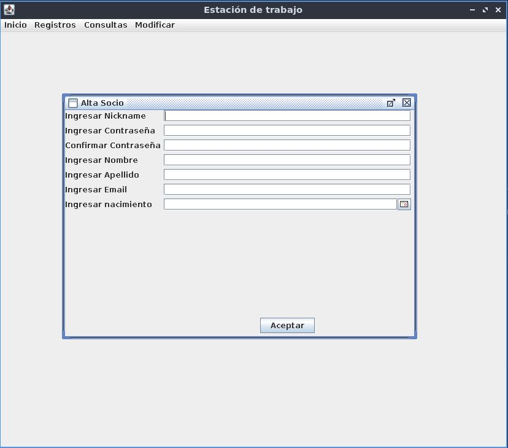
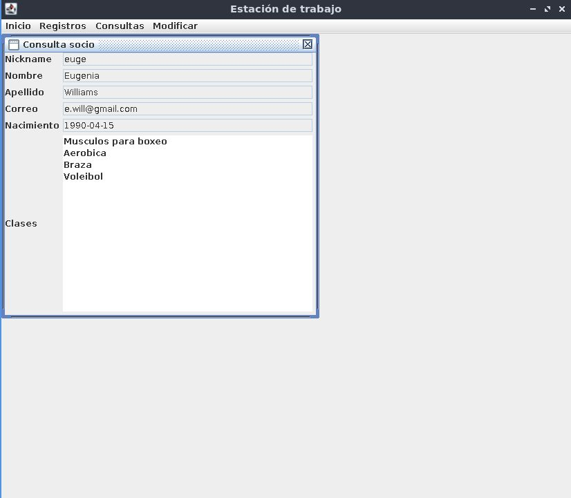
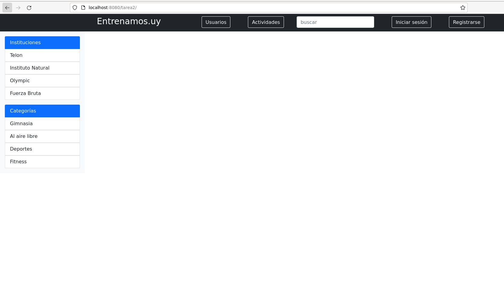
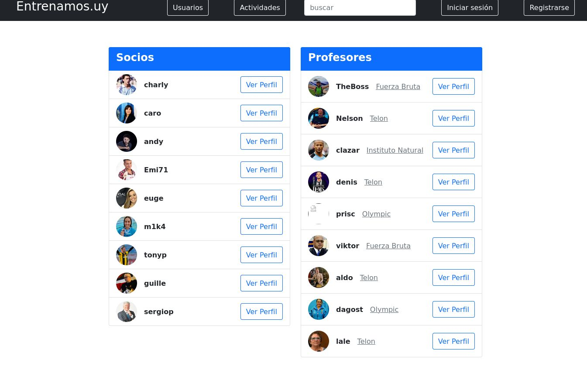
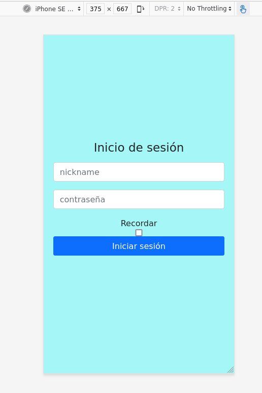

# Proyecto JAVA facultad ingenieria. Entrenamos.uy








## Pre-requisites
```
--Gradle--

curl -s "https://get.sdkman.io/" | bash
sdk install gradle

--Tomcat in ubuntu--
sudo apt install tomcat9 tomcat9-admin
sudo systemctl enable tomcat9
sudo nano /etc/tomcat9/tomcat-users.xml
add this line to the end of file.
	<user username="admin" password="admin" roles="manager-gui,manager-jmx,manager-status,manager-script,admin-gui"/>
sudo systemctl restart tomcat9

```

## Instalation
```
git clone https://github.com/Luzio5/entrenamos.uy.git

## Execution
gradle :tarea1:run
./tools/wsimport_tarea2.sh
gradle :tarea2:war
./tools/deploy.sh
```
